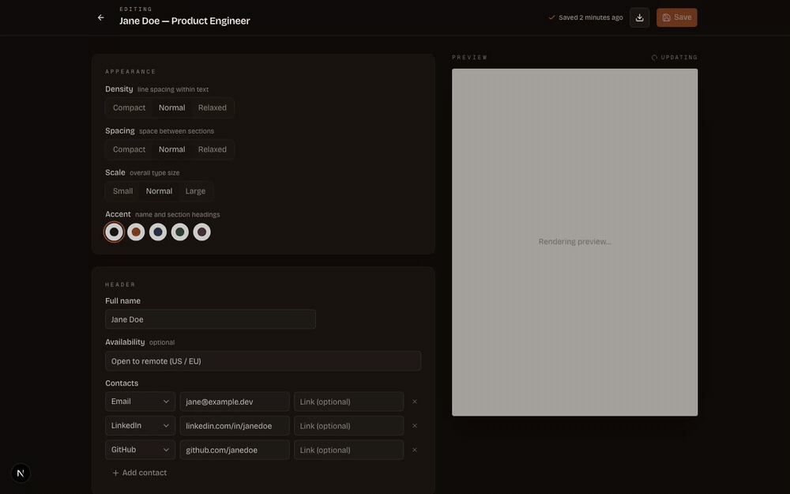

# thomasar-cv

A small, personal tool for maintaining a résumé as structured data instead of a hand-formatted document, and rendering it to a single-page A4 that parses correctly in applicant tracking systems (ATS). It keeps multiple tailored variants of one résumé under version control.

I built it because keeping my own CV in a word processor made every reorder manual layout surgery and every tailored variant a copy-paste of the whole document; treating the résumé as data fixes both. It also doubles as a portfolio piece, so the bar is "something I'm happy to put my name on," not feature count.

The problem is deliberately small; the point is to build it the way something that has to last gets built - risk-first sequencing, decisions recorded as [ADRs](./docs/decisions/), ownership enforced structurally, real tests against a real database.

**Live at [cv.thomasar.dev](https://cv.thomasar.dev)** - open the editor straight from the landing page in guest mode, no sign-up; create an account whenever you want to keep the work.

> Status: v0.4 in progress - a deployed app with email + password auth (plus a guest mode that lets a visitor try the editor anonymously and convert to an account, merging their work), per-user résumé storage, a structured editor with live preview, bounded theme controls, PDF export carrying a real, ATS-parseable text layer, and JSON Resume export. Version history and tailored variants are next. See the [roadmap](./docs/planning/roadmap.md) for direction and [idea-and-requirements.md](./idea-and-requirements.md) for scope and non-goals.



*The structured editor alongside its live preview. The theme controls (density, spacing, scale, accent) re-render through the same definition the PDF export uses, so the preview is the export.*

## Stack (as built)

- Next.js 16 (App Router, React 19) on Vercel
- tRPC v11 for the API (server + client, superjson transformer)
- Drizzle ORM on Supabase Postgres, over the postgres-js driver
- react-pdf for rendering; the on-screen preview is the export's own bytes shown through pdf.js, so they can't drift (see [ADR 0002](./docs/decisions/0002-pdf-engine.md))
- BetterAuth for email + password auth, via its Drizzle adapter
- Zod for validation (the résumé content document and server env)
- Tailwind v4 for styling
- pnpm workspaces + Turborepo, TypeScript throughout
- Vitest for unit tests (real in-process Postgres via pglite) and Playwright for e2e

## Project layout

```
apps/
  web/                 Next.js app: tRPC server + client, BetterAuth, auth pages, dashboard, e2e
packages/
  db/                  Drizzle schema (auth + resume), the résumé content Zod schema,
                       connection factory, migrations, seed fixture, pglite test harness
  render/              the résumé render definition (@thomasar-cv/render): turns a
                       ResumeContent document into PDF bytes - the one engine the
                       live preview and the export both run
  eslint-config/       shared ESLint config
  tsconfig/            shared TypeScript config
docs/
  planning/roadmap.md  milestone arc
  decisions/           architecture decision records (ADRs)
  ai/                  conventions for AI agents (e.g. the GitHub issue workflow)
```

The résumé is one validated JSONB document on a thin `resume` table, not a tree of normalized rows, so a history snapshot or tailored variant is just a copy of one document. See [docs/decisions/0001-resume-persistence.md](./docs/decisions/0001-resume-persistence.md). The content shape lives in `packages/db/src/schema/resume-content.ts` (Zod); every write goes through it since Postgres treats the column as opaque.

Ownership is enforced in app code: a single `ownedResumes` boundary scopes every read and write by `user_id`, so no caller can reach another user's data. We connect through the Supabase pooler as a service role (no Postgres RLS yet; deferred to v1.0), which is why that helper is the only access path routers may use.

## Design principles

Treating a résumé as data, not layout, drives the design:

- Content is separate from presentation: what it says is data, how it looks is rendering config.
- Structure is data: section and item order are explicit array positions, so reordering is reversible.
- One rendering definition, two outputs: the preview and the exported PDF derive from the same render definition (`@thomasar-cv/render`).
- ATS-safe by construction: exports carry a real, parseable text layer in single-column reading order.
- Deliberately small: it leaves out the feature pile-up common to résumé builders.

## Running locally

Prerequisites: Node 24 (see `.nvmrc`) and pnpm 10 (`corepack enable` sets it up); Docker too if you want to run the e2e suite.

The web app's server env already lives on Vercel, so fetch it rather than writing it by hand:

```bash
pnpm install
vercel login && vercel link                    # once: link this checkout to the project
pnpm env:pull                                  # writes apps/web/.env.local
cp packages/db/.env.example packages/db/.env   # same DATABASE_URL, for migrations
pnpm --filter @thomasar-cv/db db:migrate
pnpm dev                                        # http://localhost:3000
```

The db package needs its own `packages/db/.env` because Next only loads env from the app dir; both files use the same `DATABASE_URL` (the Supabase pooler, port 6543).

Without Vercel access, skip `env:pull` and `cp apps/web/.env.example apps/web/.env.local` instead - it documents each value, including the `BETTER_AUTH_SECRET` (any 32+ char random string, e.g. `openssl rand -base64 32`).

On a Vercel preview or locally, the sign-in page shows a **Sign in as dev** button that skips the login when you only want to reach a protected page. It's gated off in production and needs `DEV_LOGIN_EMAIL` / `DEV_LOGIN_PASSWORD` set (see `apps/web/.env.example`).

## Testing

- Unit: `pnpm test`. The DB package runs SQL-correctness and ownership tests against real in-process Postgres (pglite) via `@thomasar-cv/db/testing`, so queries are exercised for real, not mocked.
- E2e: `pnpm test:e2e` from the repo root (editor flows, cross-tenant authorization, and auth/dashboard smoke). The runner brings up a throwaway Postgres in Docker, migrates it, runs Playwright, and tears it down, so it never touches the shared database; needs Docker. Arguments forward to Playwright - `pnpm test:e2e <file>`, `--project=flows|smoke`, `-g "<title>"`.
- CI runs typecheck, lint, and unit tests on every PR, plus the same e2e run against a throwaway Postgres container.

## Scripts

Run from the repo root; Turborepo fans them out across the workspaces.

| Command          | What it does                                         |
| ---------------- | ---------------------------------------------------- |
| `pnpm check`     | typecheck + lint + test, condensed to a summary line |
| `pnpm dev`       | start all dev servers                                |
| `pnpm build`     | build every package                                  |
| `pnpm lint`      | run ESLint                                           |
| `pnpm typecheck` | run `tsc --noEmit`                                   |
| `pnpm test`      | run unit tests                                       |
| `pnpm test:e2e`  | run the Playwright e2e suite (throwaway Postgres)    |
| `pnpm format`    | format with Prettier                                 |
| `pnpm env:pull`  | pull `apps/web/.env.local` from Vercel               |

`pnpm check` is the pre-commit gate. It runs the same `typecheck lint test` that CI runs, but collapses a passing run to one summary line and, on failure, strips turbo and runner noise down to the actionable errors, so a green check means a green PR and the output stays short enough to scan in a terminal or an LLM context window. Pass `--verbose` (or run `pnpm check:verbose`) for the raw turbo output.

## Conventions

Commits follow Conventional Commits (`feat: add login form (#42)`). Non-trivial work gets a GitHub issue first; issues and milestones follow [docs/ai/github-workflow.md](./docs/ai/github-workflow.md), and project decisions are recorded as ADRs under `docs/decisions/`.
